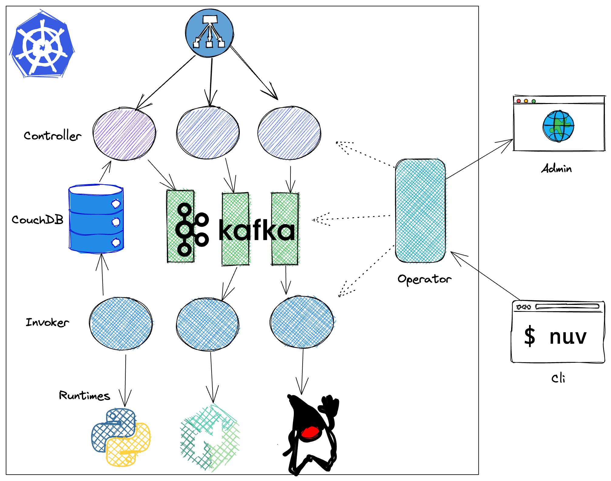
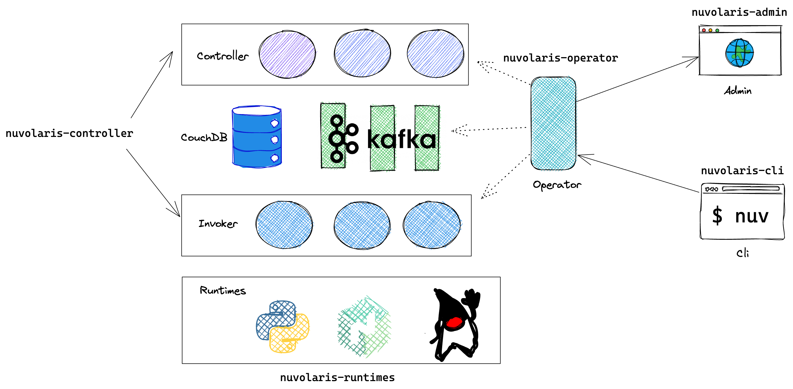

# **Nuvolaris Trainings**
## 1. Kubernetes Operator

A distribution for Serverless Everywhere

https://www.nuvolaris.org

---

---

---
# Required OpenSource Paperwork
## Signing the Open Source ICLA

- Download the pdf:
 `bit.ly/nuvolaris-icla`
- Sign and send to 
  `secretary@apache.org`
- Carbony copy to us: 
  `secretary@nuvolaris.io`

---
# Before contributing

- Assign the copyright to an open source foundation

- *Every file* you contribute *must* have the header with **copyrigh** and **license**
  -  `Copyright 2022 Apache Software Foundation`
  -  `Released under the Apache License...`

  - There is a GitHub Action checking every Pull Request
    - Adding license to your work is as easy as running:
    `license-eye header fix`

---
# How to contribute

1. Community
1. Issue
1. Fork
1. Code
1. Pull Request
1. Rewiew
1. Merge