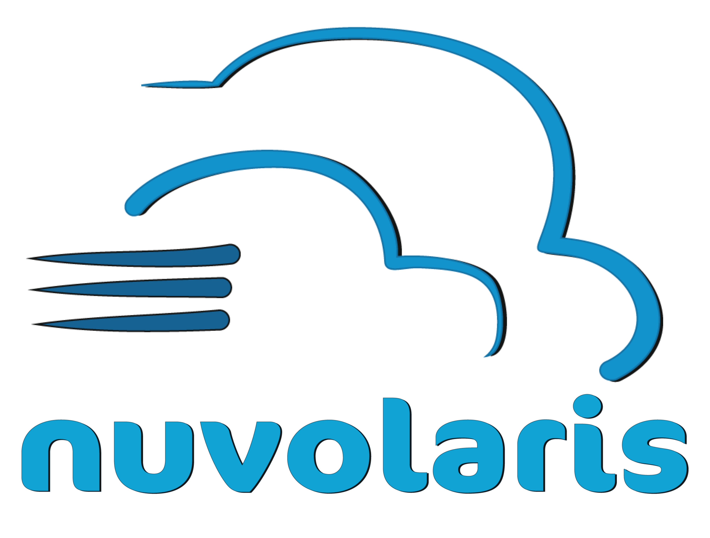
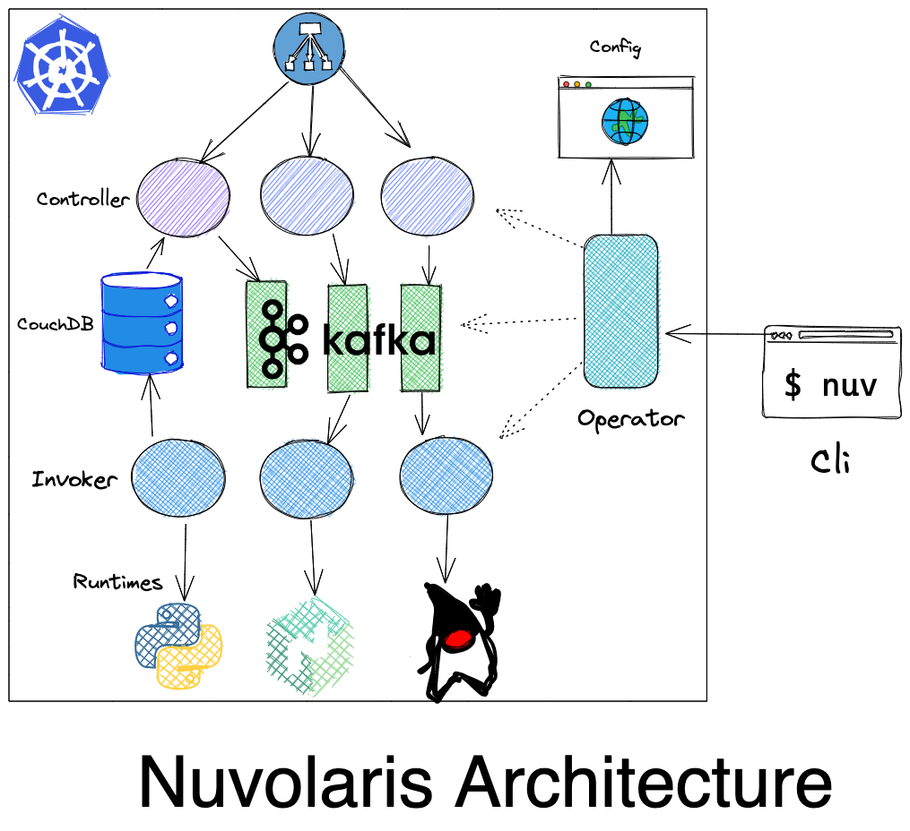

# **Nuvolaris Community 3**
## What is new 

https://www.nuvolaris.io

---

# What is Nuvolaris Community ?

 ## **Non technical definition**
 > an easy way to build application for the cloud, much faster and cheaper than the current methods.

## **Technical Definition**

 - a  Distribution of the Serverless engine [Apache OpenWhisk]() for many flavors of [Kubernetes]()

---
## Distribution? Serverless?

   - **Distribution**: a collection of software:
     - integrated and ready to run
     - it generally comes with supportes from the vendors

   - **Serverless**: coding in the cloud without *managing* servers
      - the idea: push your code to the cloud and run it
      - no server management involved!
        - the dream of every developer...

--- 
  ## OpenWhisk? Kubernetes?

   - **Apache OpenWhisk**: a open source project 
     - used by IBM, Digital Ocean, Adobe and others 
     - implements a serverless environment 

   - **Kubernetes**: the de-facto Cloud Operating System
      - think to it as a version of Linux adapted to the cloud
      - it is available everywhere, like Linux

 
---

---

---

---
# What is next?

- Setup Pyhon and Kopf
- Authentication
- Reacting to Events
- Invoking Kubectl and Kustomnize
- Implementing the Operator

---

