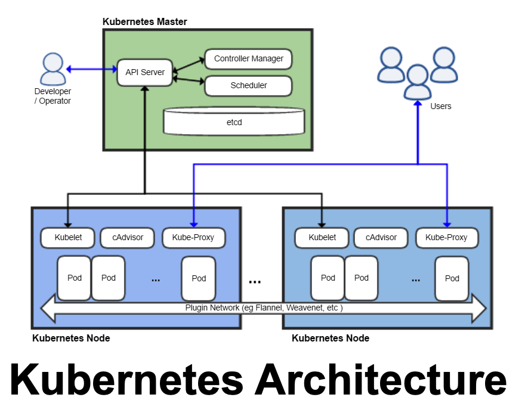
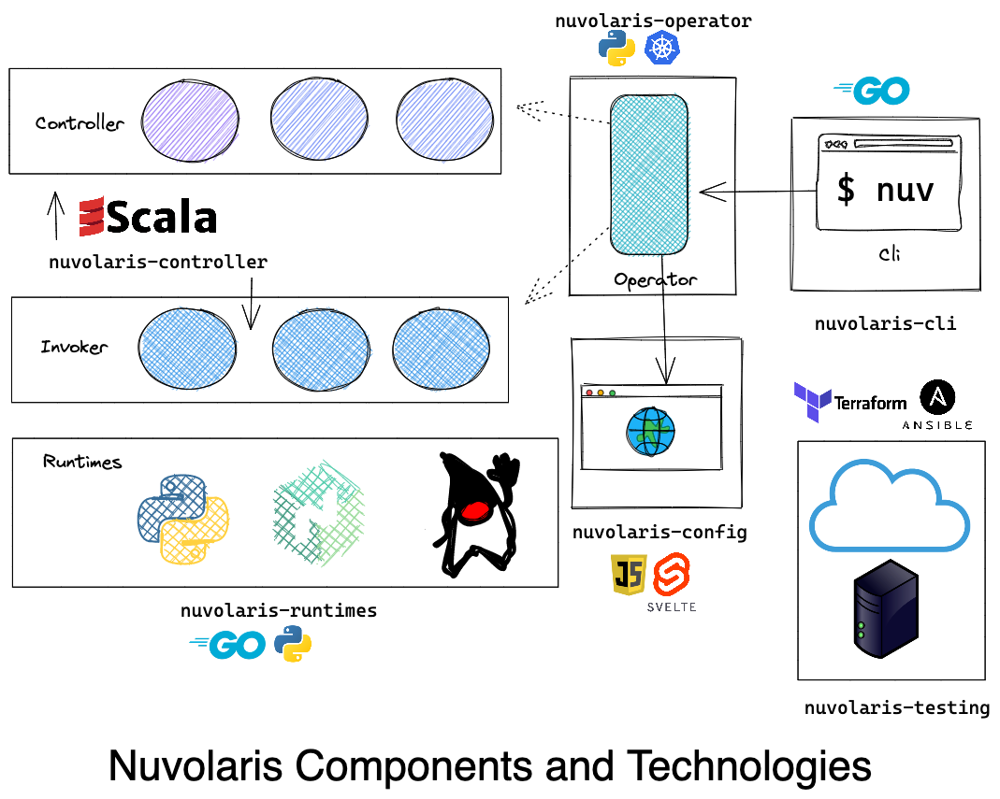

# **Nuvolaris Trainings**
## Developing Kubernetes Operators in Python


https://www.nuvolaris.io

---

# Agenda

- Kubernetes Introduction
- Development Environment
- Kubernetes Operators
- Creating an Operator
- Deploying an Operator
- Contributing to Nuvolaris

---


--- 
# What is Kubernetes ?

- In theory, an **orchestrator**
  - also Windows, originally, was just a **GUI** on top of DOS

- In practice, an **Operating System** for the cloud

## What is Nuvolaris?
 - a Serverless **distribution** for Kubernetes
 - *Linux* : **RedHat** = *Kubernetes* : **Nuvolaris**

---



---
# Kubernetes Operators

- It is a **pattern** that is becoming commonplace
  - There is *NOT* a specific API that you implement
  - You have to use the *Kubernetes API* anyway
- You define your own Resource 
  - Defining new resources as **CRD** `Custom Resource Definitions`
  - Creating instances conforming to the CRD
    - that describes the *desidered state*
  - **Writing code that brings the system to this state**
---


 
 ---
# Operator Frameworks
  - **Operator Framework**: ansible/helm/go
  - **Kudo**: a declarative, yaml based framework
  - **metacontroller**: generic, with hooks in any languages
  - **shell-operator**: write operators in bash
  - **kubebuilder**: Go based operator
  - **kopf**: Python based Operator

  also exists Java, Rust, Elixir, Javascript based operator frameworks


---


---

### Kubernetes Descriptors Concepts 
- It is declarative:
  - You **describe** what you want to get by the system
  - Kubernetes will bring the system to the desidered state

- You declare what you want with *descriptors* in YAML
  - those descriptors are in YAML format
    - actually, they are internally JSON files 
    - YAML is really syntax sugar for JSON
- Kubernetes brings the system to what you asked
  - ... **if it is possible** ...

---


---

# Structure of a descriptor

- Common: Header and Metadata
```yaml
apiVersion: v1
kind: Namespace
metadata:
  name: nuvolaris
```
- `spec`: changes according tothe kind
- `status`: maintained by the system


---
# Simple Descriptor: a Pod

```yaml
apiVersion: v1
kind: Pod
metadata:
  name: demo-pod
  namespace: demo
spec:
  containers:
    - name: nginx
      image: nginx
      ports:
      - containerPort: 80
````

---
# Nested Descriptor: a Deployment

```yaml
apiVersion: apps/v1
kind: Deployment
metadata:
  name: demo-deploy
```

Templatized, repeat the template using labels
```yaml
spec:
  replicas: 3
  selector:
    matchLabels:
      app: nginx
```
---
# Deployment template

It creates `replica` times the pods specified in the template

```yaml
  template:
    metadata:
      labels:
        app: nginx
    spec:
      containers:
      - name: nginx
        image: nginx
        ports:
        - containerPort: 80
```


---


---
## VSCode-based Development Environment

- Clone the repositories (multiple and linked)
  ```
  git clone https://github.com/nuvolaris/nuvolaris 
  --recurse-submodules
  ```
  - do not forget **`--recurse-submodules`**

- Open the folder `nuvolaris` with VSCode:
  - Command Line: `code nuvolaris`
- Open the workspaces in subfolders: `workspace.code-workspace`

---


---
# Kubernetes `kubectl`

- $ `kubectl get nodes`
```
NAME                      STATUS   ROLES                  AGE   VERSION
nuvolaris-control-plane   Ready    control-plane,master   41m   v1.21.1
nuvolaris-worker          Ready    <none>                 41m   v1.21.1
```

#### Demo: `nuvolaris-controller/training/transcript1.txt`
---


---
# Kubernetes Controllers

- Deployment, DaemonSet, StatefulSet


## What they do?
- create a set of resources
- control them as an unit
---

# Custom Resources Definitions

- Define your own Kubernetes Resources
  - create new Kinds of resources
  - Handled as other resources

# Resource Handlers

- You need to write your own resource handler!
  - It responds to Kubernetes events
  - It interacts with Kubernetes APIs to perform operations

---

# Components of a CRD

- Group, Kind and short names:
  - Example: `nuvolaris.org`, `Sample`, `sam`
- Spec and Status
  - Versioned
  - defined as an OpenApi Schema:
```yaml
 type: object
 properties:
   spec:
     type: object
```

---
# Defining a CRD  (1/2)

```yaml
apiVersion: apiextensions.k8s.io/v1
kind: CustomResourceDefinition
metadata:
  name: samples.nuvolaris.org
spec:
  scope: Namespaced
  group: nuvolaris.org
  names:
    kind: Sample
    plural: samples
    singular: sample
    shortNames:
      - sam
```
---
#### Defining a CRD (2/2)
```yaml
  versions:
    - name: v1
      served: true
      storage: true
      subresources: { status: { } } 
      schema:
        openAPIV3Schema:
          type: object
          properties:
            spec:
              type: object
              x-kubernetes-preserve-unknown-fields: true
            status:
              type: object
              x-kubernetes-preserve-unknown-fields: true
```
---
# Instance
```yaml
apiVersion: nuvolaris.org/v1
kind: Sample
metadata:
  name: obj
spec:
  count: 2
```
- Demo: `nuvolaris/nuvolaris-controller/training/transcript2.txt`
---


---
# About `kopf`
- See kopf.readthedocs.io

- Python based
  - provied an handy `kopf` cli runner

- Handlers for the various Kubernetes events:
  - `@kopf.on.login`
  - `@kopf.on.create`
  - `@kopf.on.delete`

- It does not manage Kubernetes API 
---
# Login

- Kopf supports various autentication

  - Code to support either your `~/.kube/config` or the service token

```python
@kopf.on.login()
def sample_login(**kwargs):
    token = '/var/run/secrets/kubernetes.io/serviceaccount/token'
    if os.path.isfile(token):
        logging.debug("found serviceaccount token: login via pykube in kubernetes")
        return kopf.login_via_pykube(**kwargs)
    logging.debug("login via client")
    return kopf.login_via_client(**kwargs)
```

---
# Handling object creation and deletion

```python
@kopf.on.create('nuvolaris.org', 'v1', 'samples')
def sample_create(spec, **kwargs):
    print(spec)
    return { "message": "created" }
```

```python
@kopf.on.delete('nuvolaris.org', 'v1', 'samples')
def sample_delete(spec, **kwargs):
    print(spec)
    return { "message": "delete" }
```

---


---


---
# Required OpenSource Paperwork
## Before sending a PR

- Add **Apache License** headers to each file:
  quick way: `license-eye header fix`
- Download the ICLA and sign it:
  `bit.ly/apache-icla`
- Send to 
  `To: secretary@apache.org`
  `Cc: secretary@nuvolaris.io`


