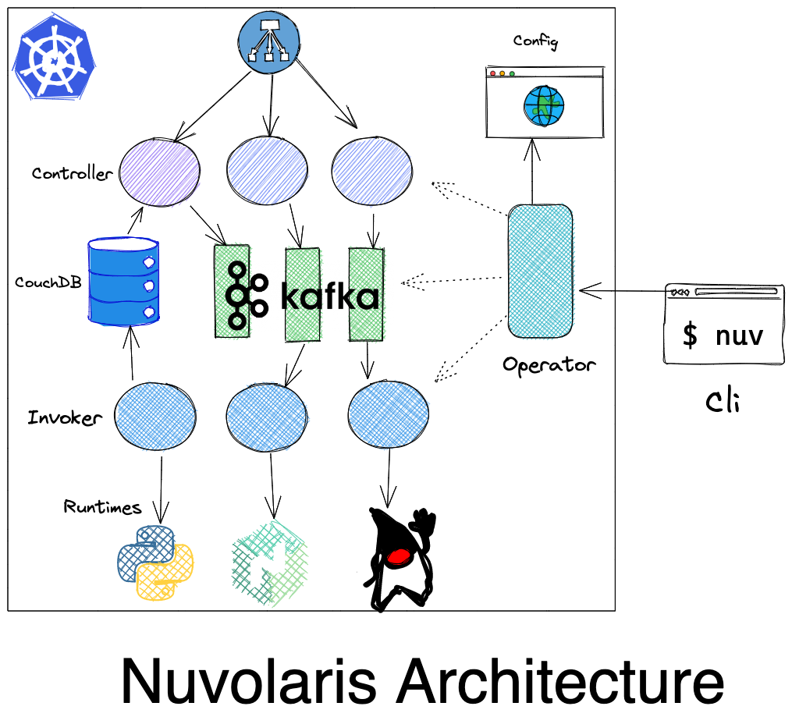

<!--
  ~ Licensed to the Apache Software Foundation (ASF) under one
  ~ or more contributor license agreements.  See the NOTICE file
  ~ distributed with this work for additional information
  ~ regarding copyright ownership.  The ASF licenses this file
  ~ to you under the Apache License, Version 2.0 (the
  ~ "License"); you may not use this file except in compliance
  ~ with the License.  You may obtain a copy of the License at
  ~
  ~   http://www.apache.org/licenses/LICENSE-2.0
  ~
  ~ Unless required by applicable law or agreed to in writing,
  ~ software distributed under the License is distributed on an
  ~ "AS IS" BASIS, WITHOUT WARRANTIES OR CONDITIONS OF ANY
  ~ KIND, either express or implied.  See the License for the
  ~ specific language governing permissions and limitations
  ~ under the License.
  ~
-->


# **Nuvolaris Trainings**
## Developing Kubernetes Operators in Python

https://www.nuvolaris.io

---

# Agenda

- Introducing Kubernetes Operators
- Handling CRDs
- Using Kustomize
- Managing resources with perator

---


---
# Kubernetes Controllers

- Deployment, DaemonSet, StatefulSet


## What they do?
- create a set of resources
- control them as an unit
---
# Kubernetes Operators

- It is a **pattern** that is becoming commonplace
  - There is *NOT* a specific API that you implement
  - You have to use the *Kubernetes API* anyway
- You define your own Resource 
  - Defining new resources as **CRD** `Custom Resource Definitions`
  - Creating instances conforming to the CRD
    - that describes the *desidered state*
  - **Writing code that brings the system to this state**


---


---
# Custom Resources Definitions

- Define your own Kubernetes Resources
  - Create new Kinds of resources
  - You can then create instances of this new Kind

# Resource Handlers

- You need to write your own resource handler!
  - It responds to Kubernetes events
  - It interacts with Kubernetes APIs to perform operations

---

# Components of a CRD

- Group, Kind and short names:
  - Example: `nuvolaris.org`, `Sample`, `sam`
- Spec and Status
  - Versioned
  - defined as an OpenApi Schema:
```yaml
 type: object
 properties:
   spec:
     type: object
```

---
# Defining a CRD  (1/2)

```yaml
apiVersion: apiextensions.k8s.io/v1
kind: CustomResourceDefinition
metadata:
  name: samples.nuvolaris.org
spec:
  scope: Namespaced
  group: nuvolaris.org
  names:
    kind: Sample
    plural: samples
    singular: sample
    shortNames:
      - sam
```
---
#### Defining a CRD (2/2)
```yaml
  versions:
    - name: v1
      served: true
      storage: true
      subresources: { status: { } } 
      schema:
        openAPIV3Schema:
          type: object
          properties:
            spec:
              type: object
              x-kubernetes-preserve-unknown-fields: true
            status:
              type: object
              x-kubernetes-preserve-unknown-fields: true
```
---
# Instance
```yaml
apiVersion: nuvolaris.org/v1
kind: Sample
metadata:
  name: obj
spec:
  count: 2
```


---
# <!--!--> Demo CRD
```sh
# check
kubectl get nodes
cd lab
kubectl apply -f demo-ns.yaml
kubectl config set-context --current --namespace demo
# create crd and instance
kubectl apply -f demo-crd.yaml
kubectl get crd
kubectl apply -f demo-obj.yaml
kubectl -n demo get sam
# cleanup
kubectl -n demo delete sam/obj
kubectl -n demo get sam
```
---


---
# About `kopf`
- See kopf.readthedocs.io

- Python based
  - provided an handy `kopf` cli runner

- Handlers for the various Kubernetes events:
  - `@kopf.on.login`
  - `@kopf.on.create`
  - `@kopf.on.delete`

- It does not manage Kubernetes API 
---
# Login

- Kopf supports various autentication

  - Code to support either your `~/.kube/config` or the service token

```python
@kopf.on.login()
def sample_login(**kwargs):
    token = '/var/run/secrets/kubernetes.io/serviceaccount/token'
    if os.path.isfile(token):
        logging.debug("found serviceaccount token: login via pykube in kubernetes")
        return kopf.login_via_pykube(**kwargs)
    logging.debug("login via client")
    return kopf.login_via_client(**kwargs)
```

---
# Handling object creation and deletion

```python
@kopf.on.create('nuvolaris.org', 'v1', 'samples')
def sample_create(spec, **kwargs):
    print(spec)
    return { "message": "created" }
```

```python
@kopf.on.delete('nuvolaris.org', 'v1', 'samples')
def sample_delete(spec, **kwargs):
    print(spec)
    return { "message": "delete" }
```

---
# <!--!--> Handling creation of objects
```sh
# install and run kopf
poetry install
poetry run kopf
# run demo1.py
cat demo1.py
poetry run kopf run demo1.py
# note the error - add ns
poetry run kopf run -n demo demo1.py
# new terminal
kubectl apply -f demo-obj.yaml
kubectl -n demo get sam
kubectl delete -f demo-obj.yaml
```

---


---
# Interacting with Kubernetes

- `kopf` does  *not* provide how to interact with Kubernetes
  - You can use any other api like `pykube`or others

- We use... `kubectl` and `kustomize`
  - It may look "odd" to use an external command line tool
  - However, this allows compatibility with command line tools
    - avoding "strange" templating
    - easier development and debug

---
# About `kustomize`

- Originally a separate tool, now part of `kubectl`
  - It works "customizing" sets of descriptors with rules
  - support many ways of *patching* the JSON/YAML 
  - **NO TEMPLATING** (huge win over `helm`!)

- You simply do `kubectl apply -k <folder>`
  - It will search for `kustomization.yaml`
  - It will produce the output sent to Kubernetes

- Debug the output without applying with:
  `kubectl kustomize <folder>`
---
## Simple `kustomizationl.yaml` with patch

```yaml
apiVersion: kustomize.config.k8s.io/v1beta1
kind: Kustomization
resources:
- demo-deployment.yaml
patches:
 - path: patch.yaml
```

- put it in a folder `deploy` and `apply -k deploy`
---
# Sample patch of a `Deployment`

- We want to change the replica count

```yaml
apiVersion: apps/v1
kind: Deployment
metadata:
  name: demo-deploy
  namespace: demo
spec:
  replicas: 1
```
- Intuitively, provide enough *context* to locate the descriptor
- Then, provide the **replaced fields**: `replicas: 1`
---


---
# <!--!--> Demo Kustomize
```sh
cat demo-deployment.yaml
kubectl apply -f demo-deployment.yaml
kubectl get deploy ; kubectl get po
kubectl delete deploy demo-deploy
kubectl get deploy ; kubectl get po
# kustomize
cat kustomization.yaml
cat patch.yaml
# prepare the customization
rm -Rvf deploy ; mkdir deploy
cp demo-deployment.yaml kustomization.yaml patch.yaml deploy
# apply the kustomization
kubectl apply -k deploy
kubectl get deploy ; kubectl get po 
kubectl delete -k deploy
kubectl get deploy ; kubectl get po 
```
---


---
# Using `kubectl` from the operator
```python
# generate patch
def patch(n):
  return f"""apiVersion: apps/v1
kind: Deployment
metadata:
  name: demo-deploy
spec:
  replicas: {n}
"""
# run kubectl
def kubectl(cmd, patch):
  with open(f"deploy/patch.yaml", "w") as f:
    f.write(patch)
  res = subprocess.run(["kubectl", cmd, "-k", "deploy"], capture_output=True)
  return res.stdout.decode()
```
---
# Implementing the operator

```python
@kopf.on.create('nuvolaris.org', 'v1', 'samples')
def sample_create(spec, **kwargs):
    count = spec["count"]
    message = kubectl("apply", patch(count))
    return { "message": message }

@kopf.on.delete('nuvolaris.org', 'v1', 'samples')
def sample_delete(spec, **kwargs):
    count = spec["count"]
    message = kubectl("delete", patch(count))
    return { "message": "delete" }
```
---
# <!--!--> Demo Operator
```sh
# cleanup
kubectl delete -f demo-obj.yaml
poetry run kopf run -n demo demo2.py
# switch terminal
cat demo-obj.yaml
kubectl apply -f demo-obj.yaml
# checking if it worked
cat deploy/patch.yaml
kubectl get deploy
```
---
# Packaging

- Create a Dockerfile embedding the operator
  - You need `poetry`, `kopf` an `kubectl` in the image
- Deploy the POD with the right permissions
  - You need to setup *Kuberbetes RBAC*
  - `ServiceAccount` and `ClusterRoleBinding`
- See `nuvolaris/nuvolaris-operator` for an example
