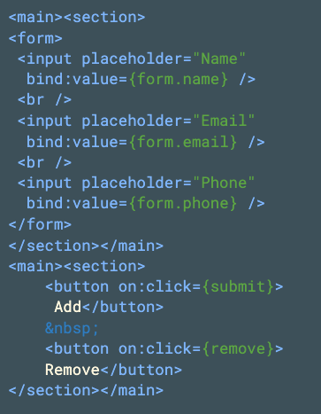

# **Nuvolaris Trainings**
## Java Demo

https://www.nuvolaris.io

---
# <!--!--> Init
```sh
echo "drop table addr;" | psql address
source nuv.src
nuv action list | awk '/private/{ print $1}' | xargs -L1 nuv action delete
nuv package delete address
oc login -u nuvolaris -p s3cr3t
oc project nuvolaris
oc get pod
```
---


---
# <!--!--> Connection to the database
```java
// conneciton url passed as parameter
String postgres = args.getAsJsonPrimitive("postgres").getAsString();
// creating connection
Class.forName("org.postgresql.Driver");
Connection conn = DriverManager.getConnection(postgres);
```

---
# <!--!--> Creating the table
```java
        // create the table
        Statement stmt = conn.createStatement();
        int count = stmt.executeUpdate(
                      "create table addr("
                    + "id serial primary key,"
                    + "name varchar(20),"
                    + "phone numeric," 
                    + "email varchar(20))");
        JsonObject response = new JsonObject(); 
        // response      
        response.addProperty("result", count);
        return response;
```

---
# <!--!--> Execution
```sh
# creating address
cat address/Create.java
nuv package update address -p postgres "$POSTGRES"
nuv action update address/Create address/Create.java --main=Create
nuv action list
# initialize table
echo "\dt" | psql address
nuv invoke address/Create
echo "\dt" | psql address
oc get pod
```
---


---
# <!--!--> Insert and Delete

```java
        // insert
        PreparedStatement prep = conn.prepareStatement(
            "insert into addr(name,phone,email) values(?,?,?)"
        );
        prep.setString(1, args.getAsJsonPrimitive("name").getAsString());
        prep.setInt(2, Integer.parseInt(args.getAsJsonPrimitive("phone").getAsString()));
        prep.setString(3, args.getAsJsonPrimitive("email").getAsString());
        JsonObject response = new JsonObject();
        response.addProperty("result", prep.executeUpdate());
        return response;
```

```java 
        // delete
        JsonObject response = new JsonObject();
        int id = Integer.parseInt(args.getAsJsonPrimitive("id").getAsString());
        response.addProperty("result", stmt.executeUpdate("delete from addr where id="+id));
        return response;
```

---
# <!--!--> Select

```java
        ResultSet rs = stmt.executeQuery(
            "SELECT id,name,phone,email from addr");
        JsonArray  result = new JsonArray();
        while(rs.next()) {
            JsonObject record = new JsonObject();
            record.addProperty("id", rs.getInt("id"));
            record.addProperty("name", rs.getString("name"));
            record.addProperty("phone", rs.getInt("phone"));
            record.addProperty("email", rs.getString("email"));
            result.add(record);
        }
        JsonObject response = new JsonObject();
        response.add("data", result);
        return response;
    }
```

---
# <!--!--> Deploy

```sh
# deploy
nuv action update address/insert address/Insert.java --main=Insert --web=true
nuv action update address/delete address/Delete.java --main=Delete --web=true
nuv action update address/select address/Select.java --main=Select --web=true
# test
nuv invoke address/insert name=Michele phone=392 email=mike
nuv invoke address/select
nuv invoke address/insert name=Mirella phone=328 email=miri
nuv invoke address/select
nuv invoke address/delete id=1
nuv invoke address/select
```

---


---


---
# <!--!-->

```html
<main><section>
  <table>
    <tr>
      <th></th><th>Name</th>
      <th>Company</th>
      <th>Phone</th>
    </tr>
    {#each data as row}
      <tr>
        <td><input type="radio" 
                   bind:group={select} 
                   value={row.id}></td>
        <td><b>{row.name}</b></td>
        <td><i>{row.email}</i></td>
        <td><tt>{row.phone}</tt></td>
      </tr>
    {/each}
  </table>
</section></main>
```

---
```js
// data
let select = ""
let data = []
let form = {}
async function all()  {
      let res = await fetch(base+"select.json")
      let body = await res.json()
      data = body.data
}
function submit() {
        fetch(base+"insert", { method: 'POST', 
            headers: { 'Content-Type': 'application/json' }, 
            body: JSON.stringify(form) })
        .then(all)
        form = {}
}
function remove() {
    fetch(base+"delete?id="+select).then(all).catch(console.log)
}
// init
onMount(all)
```

---
# <!--!--> Building and Deploying Frontend
```sh
npx degit sveltejs/template addr
cp -v App.svelte addr/src
cd addr
npm install
npm run dev
```

---


---
```sh
# cleanup
nuv action list | awk '/private/{ print $1}' | xargs -L1 nuv action delete
nuv action list
# bundling the frontend
nuv bundle addr/public
nuv project deploy
# access the app
nuv action list
nuv url address/app
curl $(nuv url address/app)