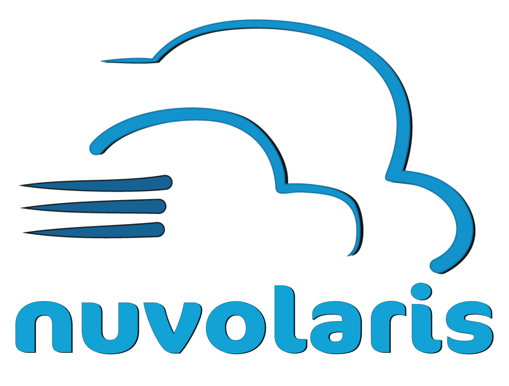
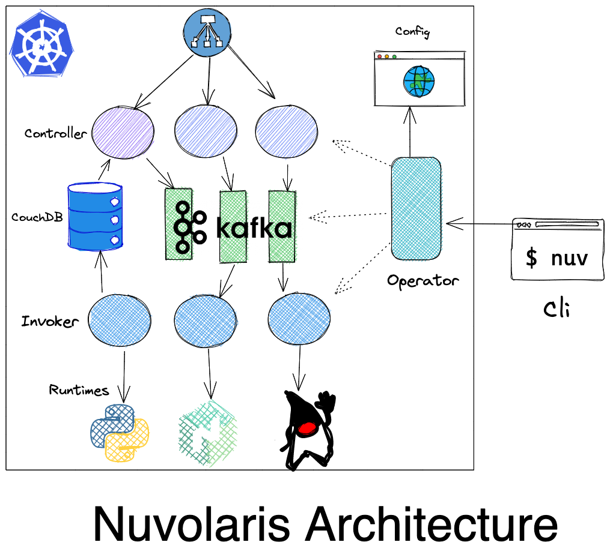
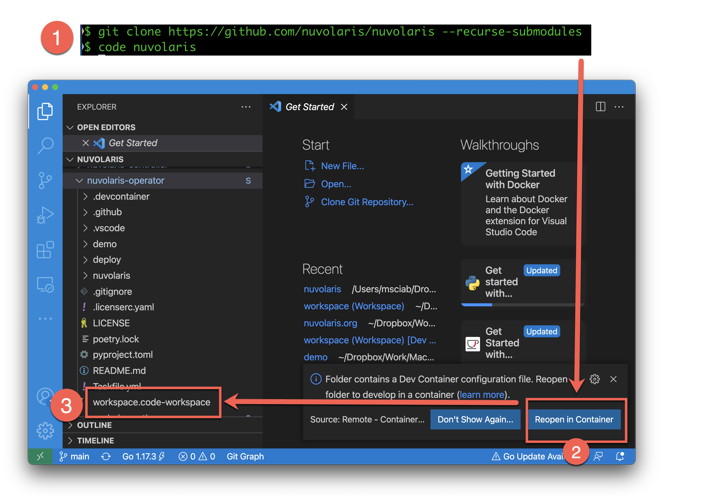
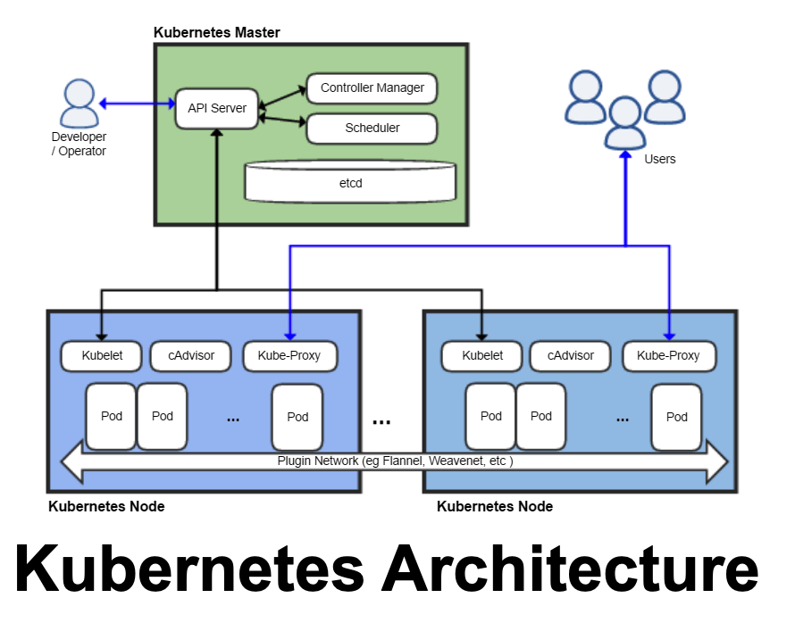
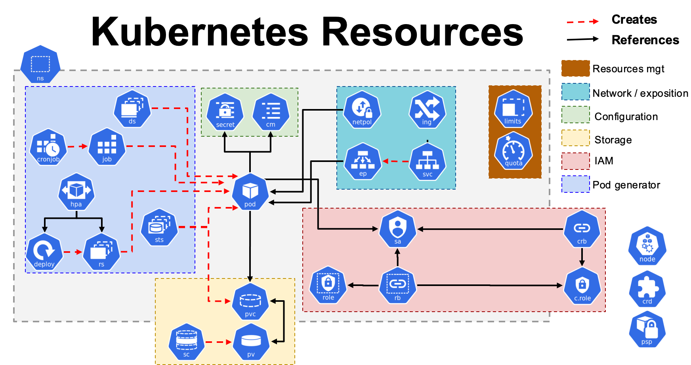
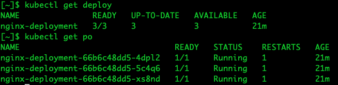

# **Nuvolaris Trainings**
## Nuvolaris Operator

Part 1: Introducting Kubernetes Operators

https://www.nuvolaris.io

---

# Agenda (Part 1)

- The Nuvolaris Project
- Development Environment
- Kubernetes 101
- Custom Resource Definitions
- Kustomize

---
# What is Kubernetes ?

- In theory, an **orchestrator**
  - also Windows, originally, was just a **GUI** on top of DOS

- In practice, an **Operating System** for the cloud

## What is Nuvolaris?
 - a Serverless **distribution** for Kubernetes
 - *Linux* : **RedHat** = *Kubernetes* : **Nuvolaris**

---



---
# Kubernetes Operators

- It is a **pattern** that is becoming commonplace
  - There is *NOT* a specific API that you implement
  - You have to use the *Kubernetes API* anyway
- You define your own Resource 
  - Defining new resources as **CRD** `Custom Resource Definitions`
  - Creating instances conforming to the CRD
    - that describes the *desidered state*
  - **Writing code that brings the system to this state**

---
# Operator Frameworks
  - **Operator Framework**: ansible/helm/go
  - **Kudo**: a declarative, yaml based framework
  - **Metacontroller**: generic, with hooks in any languages
  - **Shell-operator**: write operators in bash
  - **Kubebuilder**: Go based operator
  - **Kopf**: Python based Operator

  also exists Java, Rust, Elixir, Javascript based operator frameworks

---


---
## VSCode-based Development Environment

- Clone the repositories (multiple and linked)
  ```
  git clone https://github.com/nuvolaris/nuvolaris 
  --recurse-submodules
  ```
  - do not forget **`--recurse-submodules`**

- Open the folder `nuvolaris` with VSCode:
  - Command Line: `code nuvolaris`
- Open the workspaces in subfolders: `workspace.code-workspace`

---


---
# Test Nuvolaris Operator

- Open `nuvolaris-operator/workspace.code-workspace`

-  `kubectl get nodes`
```
NAME                      STATUS   ROLES                  AGE   VERSION
nuvolaris-control-plane   Ready    control-plane,master   41m   v1.21.1
nuvolaris-worker          Ready    <none>                 41m   v1.21.1
```

- Test
```
cd tests
task deploy
task wsk
```


---


---



---
# <!--!--> Kubernetes `kubectl` Commands
```txt
# checking nodes and namespaces
kubectl get nodes
kubectl get ns
kubectl create ns demo
kubectl get ns
# default namespace
kubectl config set-context --current --namespace demo
# various resourcs
kubectl get pod
kubectl get deploy
kubectl get svc
```

---
### Kubernetes Descriptors Concepts 
- Kubernetes is declarative:
  - You **describe** what you want to get by the system
  - Kubernetes will bring the system to the desidered state

- You declare what you want with *descriptors* in YAML
  - those descriptors are in YAML format
    - actually, they are internally JSON files 
    - YAML is really syntax sugar for JSON
- Kubernetes brings the system to what you asked
  - ... **if it is possible** ...

---



---

# Structure of a Kubernetes resource

- Common: Header and Metadata
```yaml
apiVersion: v1                # resources are versioned AND grouped
kind: Pod                     # each resource has a `kind`
metadata:
  name: demo-pod              # name of the resources
  namespace: demo             # grouped in a namespace
  labels:                     # used to locate resources
     app: demo                # formact key=value
```
- `spec`: changes according to the kind
- `status`: maintained by the system

---
# Simple Descriptor: a Pod

- A pod is a *set* of containers
  - the closest thing to `docker run`

```yaml
apiVersion: v1
kind: Pod
metadata:
  name: demo-pod
  namespace: demo
spec:
  containers:
    - name: nginx
      image: nginx
      ports:
      - containerPort: 80
```

---
# <!--!--> Deploy Pod
```txt
cat demo-pod.yaml
kubectl apply -f demo-pod.yaml
kubectl get pod
kubectl delete pod demo-pod
```

---
# Nested Descriptor: a Deployment

```yaml
apiVersion: apps/v1
kind: Deployment
metadata:
  name: demo-deploy
```

Templatized, repeat the template using labels
```yaml
spec:
  replicas: 3
  selector:
    matchLabels:
      app: nginx
```


---
# Deployment template

It creates `replica` times the pods specified in the template

```yaml
  template:
    metadata:
      labels:
        app: nginx
    spec:
      containers:
      - name: nginx
        image: nginx
        ports:
        - containerPort: 80
```

---
# <!--!--> Deploy a Deployment
```txt
cat demo-deployment.yaml
kubectl apply -f demo-deployment.yaml
kubectl get deploy
kubectl get pod
kubectl delete -f demo-deployment.yaml
kubectl get deploy
kubectl get pod
```
---


---
# Kubernetes Controllers

- Deployment, DaemonSet, StatefulSet



## What they do?
- create a set of resources, then control them as an unit
- **Operators** are an extension of the concept
---

# Custom Resources Definitions

- Define your own Kubernetes Resources
  - create new Kinds of resources
  - Handled as other resources

# Resource Handlers

- You need to write your own resource handler!
  - It responds to Kubernetes events
  - It interacts with Kubernetes APIs to perform operations

---

# Components of a CRD

- Group, Kind and short names:
  - Example: `nuvolaris.org`, `Sample`, `sam`
- Spec and Status
  - Versioned
  - defined as an OpenApi Schema:
```yaml
 type: object
 properties:
   spec:
     type: object
```

---
# Defining a CRD  (1/2)

```yaml
apiVersion: apiextensions.k8s.io/v1
kind: CustomResourceDefinition
metadata:
  name: samples.nuvolaris.org
spec:
  scope: Namespaced          # Namespaced or Cluster wide 
  group: nuvolaris.org       # Group (resources are grouped)
  names:
    kind: Sample             # Kind (and its names)
    plural: samples
    singular: sample
    shortNames:
      - sam
```
---
#### Defining a CRD (2/2)
```yaml
  versions:
    - name: v1
      served: true
      storage: true
      subresources: { status: { } } 
      schema:
        openAPIV3Schema:
          type: object
          properties:
            spec:
              type: object
              x-kubernetes-preserve-unknown-fields: true
            status:
              type: object
              x-kubernetes-preserve-unknown-fields: true
```
---
# Instance
```yaml
apiVersion: nuvolaris.org/v1
kind: Sample
metadata:
  name: obj
spec:
  count: 2
```
---
# <!--!--> Demo
```txt
cat demo-crd.yaml
kubectl apply -f demo-crd.yaml
kubectl get crd
cat demo-obj.yaml
kubectl apply -f demo-obj.yaml
kubectl get samples
kubectl delete sample obj
```
---


---
# Interacting with Kubernetes

- Resources needs to be adapted to various cases
  - there are literally tens of solutions for this problem
  - `helm`is very used, but... 
    - templating YAML is not a great idea!
    - lot of code just to manage whitespaces!

- We are goingo to use `kustomize`
  - part of `kubectl` 
  - much easier development and debug
---
# About `kustomize`

- Originally a separate tool, now part of `kubectl`
  - It works "customizing" sets of descriptors with rules
  - support many ways of *patching* the JSON/YAML 
  - **NO TEMPLATING** (huge win over `helm`!)

- You simply do `kubectl apply -k <folder>`
  - It will search for `kustomization.yaml`
  - It will produce the output sent to Kubernetes

- Debug the output without applying with:
  `kubectl kustomize <folder>`
---
## Simple `kustomizationl.yaml` with patch

``` yaml
apiVersion: kustomize.config.k8s.io/v1beta1
kind: Kustomization
resources:
- demo-deployment.yaml
patches:
 - path: patch.yaml

```

- put it in a folder `deploy` and `apply -k deploy`
---
# Sample patch of a `Deployment`

- We want to change the replica count

```yaml
apiVersion: apps/v1
kind: Deployment
metadata:
  name: demo-deploy
spec:
  replicas: 2
```
- Intuitively, provide enough context to locate the descriptor
- Provide the replaced fields

---
# <!--!--> Kustomize example
```txt
cat demo-deployment.yaml | grep replica
# create a customization
mkdir deploy
cp demo-deployment.yaml deploy
cp patch.yaml deploy
cp kustomization.yaml deploy
# kustomization deploy
kubectl kustomize deploy | grep replica
kubectl apply -k deploy
kubectl get po
```

---


---
# What is next?

- Setup Pyhon and Kopf
- Authentication
- Reacting to Events
- Invoking Kubectl and Kustomnize
- Implementing the Operator

---


---
# Contributing to Nuvolaris

## Before sending a Pull Request you need:

- Add **Apache License** headers to each file:

- The simplest way: 
 `license-eye header fix`

- There is a check for each Pull Request
 ### Regular contributors need to sign the Apache ICLA

